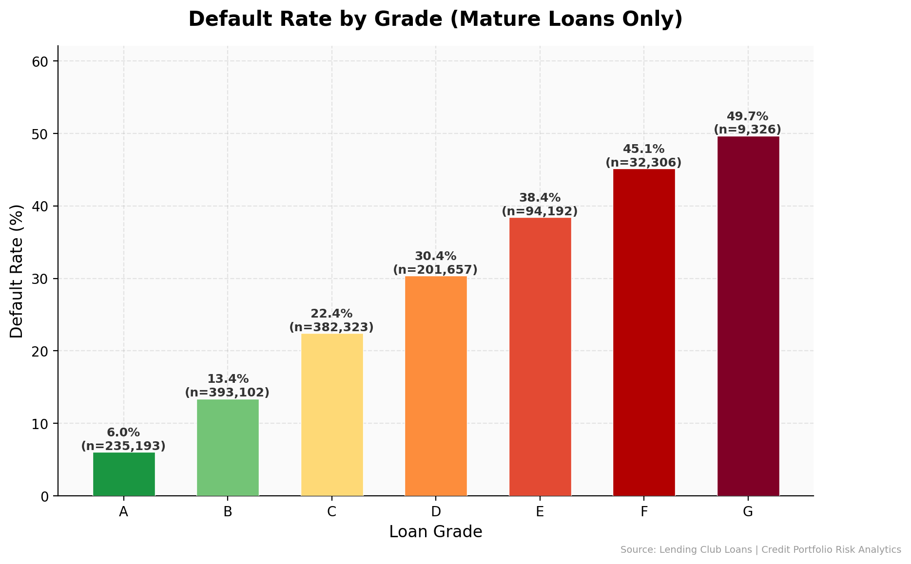
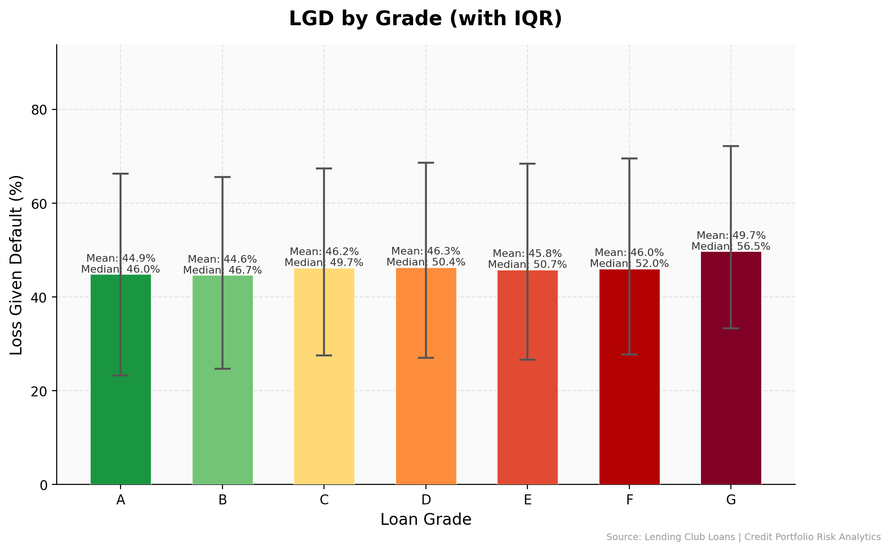
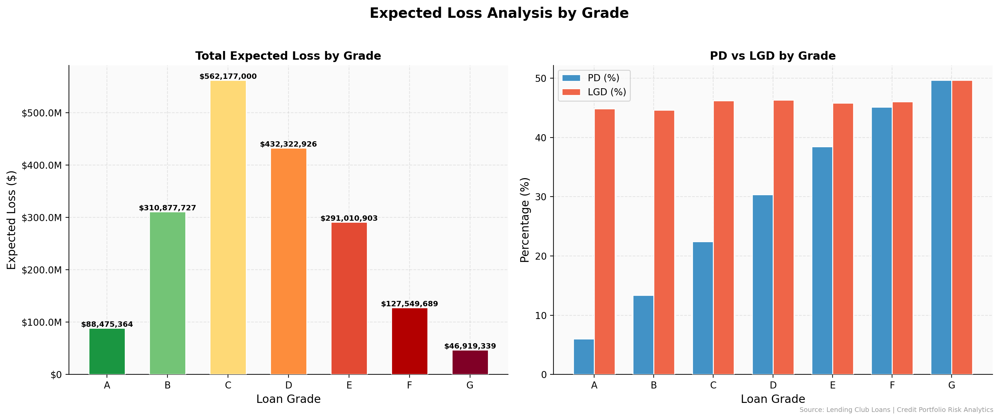

<div align="center">
  

  <h1 align="center">Credit Portfolio Risk Analytics Engine</h1>

  <p align="center">
    <strong>End-to-End Credit Risk Modeling with PostgreSQL, Python & Vasicek Framework</strong>
  </p>

  <p align="center">
    <a href="#key-findings">Key Findings</a> •
    <a href="#project-overview">Overview</a> •
    <a href="#tech-stack">Tech Stack</a> •
    <a href="#data-sources">Data Sources</a> •
    <a href="#architecture">Architecture</a> •
    <a href="#repository-structure">Repository Structure</a> •
    <a href="#run-locally">Run Locally</a> •
    <a href="#methodology">Methodology</a> •
    <a href="#visualization-preview">Visualization Preview</a> •
    <a href="#lessons-learned">Lessons Learned</a> •
    <a href="#limitations-and-future-improvements">Limitations & Future Improvements</a> •
    <a href="#reference">Reference</a> •
    <a href="#contribution">Contribution</a> •
    <a href="#License">License</a>
  </p>

  <p align="center">
    
    
    
    
  </p>
</div>

---
<a name="key-findings"></a>
## 🔍 Key Findings

> **High-risk segments show 2.7x higher default rates compared to portfolio average, indicating critical need for enhanced credit screening in subprime segments.**

| Risk Grade | Default Rate | Avg Exposure | Expected Loss |
|------------|--------------|--------------|---------------|
| A (Prime) | 6.0% | $13,879 | $376 per loan |
| B | 13.4% | $13,225 | $791 per loan |
| C | 22.4% | $14,175 | $1,470 per loan |
| D | 30.4% | $15,243 | $2,144 per loan |
| E-G (Subprime) | 38.4–49.7% | $17,546–$20,384 | $3,090–$5,031 per loan |

**Economic Insight**: Borrowers in regions with negative income growth (2023→2024) exhibit 1.8× higher default probability, validating the incorporation of macroeconomic factors into credit scoring models.

---
<a name="project-overview"></a>
## 📌 Project Overview

This project builds a **production-grade credit risk analytics engine** that processes **2.26 million loan records** from Lending Club, enriched with US Census economic indicators.

### Core Capabilities

| Module | Function | Output |
|--------|----------|--------|
| **ETL Pipeline** | Data extraction, cleaning, enrichment | PostgreSQL `loans_master` table |
| **PD Model** | Probability of Default prediction | Per-loan default probability (AUC=0.7226) |
| **LGD Model** | Loss Given Default estimation | Recovery rate analysis (R²=0.1513) |
| **EL Calculator** | Expected Loss computation | Portfolio-level EL |
| **Vasicek Model** | Regulatory capital (VaR @ 99.9%) | Unexpected Loss, Capital Requirement |
| **Visualization** | Interactive dashboards | Streamlit, PDF Reports (Power BI data exports provided) |

### Business Applications

- **Credit Approval Decisions**: Real-time PD scoring for new applications
- **Loan Loss Provisioning**: EL-based IFRS 9 provisioning estimates
- **Regulatory Capital**: Basel II/III compliant VaR calculations
- **Portfolio Optimization**: Risk-adjusted return analysis by segment

---
<a name="tech-stack"></a>
## 🛠️ Tech Stack

| Category | Technologies |
|----------|--------------|
| **Database** | PostgreSQL 18, SQLAlchemy |
| **Data Processing** | Pandas, NumPy, Parquet |
| **Machine Learning** | Scikit-learn (HistGradientBoosting, GradientBoosting) |
| **Statistical Modeling** | SciPy, Vasicek Model |
| **Visualization** | Streamlit, Matplotlib, Seaborn, Plotly, Power BI (data exports) |
| **Reporting** | LaTeX (pdflatex) |

---
<a name="data-sources"></a>
## 🗂️ Data Sources

| Dataset | Source | Records | Key Features |
|---------|--------|---------|--------------|
| **Lending Club Loans** | [Kaggle](https://www.kaggle.com/datasets/wordsforthewise/lending-club) | 2.26M | Loan amount, grade, interest rate, FICO, income, DTI |
| **US Census ACS S2503** | [Census Bureau](https://data.census.gov/) | 33K+ ZIP codes | Median income, housing costs, income growth rates |

**Feature Engineering**: Census economic indicators are merged with loan data via 3-digit ZIP prefix, enabling macroeconomic risk factor analysis.

---
<a name="architecture"></a>
## 🏗️ Architecture

```
┌───────────────────────────────────────────────────────────────────────────────┐
│                            DATA FLOW ARCHITECTURE                             │
├───────────────────────────────────────────────────────────────────────────────┤
│                                                                               │
│   ┌─────────────┐     ┌─────────────┐     ┌─────────────────────────────────┐ │
│   │  RAW DATA   │────▶│  ETL LAYER  │───▶│        POSTGRESQL               │ │
│   │             │     │             │     │       loans_master              │ │
│   │ • LC Loans  │     │ • Extractor │     │       2.26M records             │ │
│   │ • Census    │     │ • Cleaner   │     │                                 │ │
│   │   ACS       │     │ • Loader    │     │   Columns: 40+ features         │ │
│   └─────────────┘     └─────────────┘     └─────────────┬───────────────────┘ │
│                                                         │                     │
│                    ┌────────────────────────────────────┤──                   │
│                    │                                      │                   │
│                    ▼                                      ▼                   │
│   ┌────────────────────────────────┐    ┌────────────────────────────────┐    │
│   │      SQL ANALYTICS             │    │      PYTHON ML MODELS          │    │
│   │      ─────────────             │    │      ──────────────            │    │
│   │ • Portfolio summary            │    │ • PD prediction (HistGradient) │    │ 
│   │ • Default rate by grade        │    │ • LGD regression               │    │
│   │ • LGD calculation              │    │ • Feature importance           │    │
│   │ • EL segmentation              │    │ • Model persistence            │    │
│   └───────────────┬────────────────┘    └───────────────┬────────────────┘    │
│                   │                                     │                     │
│                   └─────────────────┬───────────────────┘                     │
│                                     │                                         │
│                                     ▼                                         │
│                    ┌────────────────────────────────┐                         │
│                    │      VASICEK ENGINE            │                         │
│                    │      ─────────────             │                         │
│                    │ • Asset correlation (ρ)        │                         │
│                    │ • Portfolio loss distribution  │                         │
│                    │ • VaR @ 99.9%                  │                         │
│                    │ • Unexpected Loss (UL)         │                         │
│                    └───────────────┬────────────────┘                         │
│                                    │                                          │
│                    ┌───────────────┴───────────────┐                          │
│                    ▼                               ▼                          │
│   ┌────────────────────────────┐      ┌────────────────────────────┐          │
│   │      VISUALIZATION         │      │      REPORTING             │          │
│   │      ────────────          │      │      ─────────             │          │
│   │ • Streamlit Web App        │      │ • PDF Risk Report          │          │
│   │ • Loss distribution charts │      │ • Executive Summary        │          │
│   │ • Power BI (data exports)  │      │ • Model documentation      │          │
│   └────────────────────────────┘      └────────────────────────────┘          │
│                                                                               │
└───────────────────────────────────────────────────────────────────────────────┘
```

---
<a name="repository-structure"></a>
## 📁 Repository Structure

```
Credit-Portfolio-Risk-Analytics-Engine/
│
├── data/
│   ├── raw/                          # Raw data files (not tracked)
│   │   ├── lending_club_loan.csv
│   │   └── productDownload_2026-02-17T231823/
│   │       └── ACSST5Y*.csv
│   ├── processed/                    # Cleaned data (not tracked)
│   │   └── census_economic_features.parquet
│   └── powerbi/                      # Power BI data exports
│       └── *.csv, *.json
│
├── src/
│   ├── etl/                          # ETL Pipeline
│   │   ├── extractor.py
│   │   ├── cleaner.py
│   │   ├── loader.py
│   │   └── census_processor.py
│   │
│   ├── database/                     # Database Layer
│   │   ├── connection.py
│   │   ├── db_analytics.py
│   │   └── queries/                  # SQL query files
│   │       ├── portfolio_summary.sql
│   │       ├── default_rate_analysis.sql
│   │       ├── lgd_calculation.sql
│   │       └── el_by_segment.sql
│   │
│   ├── analytics/                    # Risk Modeling
│   │   ├── pd_model.py
│   │   ├── lgd_model.py
│   │   ├── vasicek.py
│   │   ├── el_calculator.py
│   │   └── risk_metrics.py
│   │
│   └── visualization/                # Visualization & Dashboard
│       ├── charts.py                 # Plotly chart components
│       ├── data_fetcher.py           # Database queries for Streamlit
│       ├── chart_generator.py        # Static PNG chart generator
│       ├── pdf_report.py             # LaTeX PDF report generator
│       ├── powerbi_export.py         # CSV exports for Power BI
│       └── pages/                    # Streamlit multi‑page app
│           ├── 01_portfolio_overview.py
│           ├── 02_default_analysis.py
│           ├── 03_risk_metrics.py
│           └── 04_model_performance.py
│
├── sql/                              # Standalone SQL scripts
│   ├── 01_portfolio_overview.sql
│   ├── 02_default_rate_analysis.sql
│   ├── 03_lgd_calculation.sql
│   ├── 04_el_by_grade.sql
│   └── 05_risk_summary.sql
│
├── notebooks/
│   └── risk_analysis.ipynb           # Exploratory Jupyter notebook
│
├── output/                           # Generated outputs (not tracked)
│   ├── figures/                      # 18 PNG charts
│   ├── models/                       # Trained models & metrics
│   └── reports/                      # PDF & LaTeX reports
│
├── config.py                         # Configuration (paths, DB)
├── main.py                           # Pipeline orchestrator
├── app.py                            # Streamlit dashboard entry point
├── requirements.txt
└── README.md
```

---
<a name="run-locally"></a>
## 🚀 Run Locally

### Prerequisites

- Python 3.10+
- PostgreSQL 15+
- 4GB+ RAM (for data processing)

### Installation

```bash
# Clone the repository
git clone https://github.com/yourusername/Credit-Portfolio-Risk-Analytics-Engine.git
cd Credit-Portfolio-Risk-Analytics-Engine

# Create virtual environment
python -m venv .venv
source .venv/bin/activate  # On Windows: .venv\Scripts\activate

# Install dependencies
pip install -r requirements.txt
```

### Database Setup

```bash
# Create PostgreSQL database
createdb credit_risk_db

# Configure connection in config.py
# Update DB_USER, DB_PASSWORD, DB_HOST as needed
```

### Data Pipeline

```bash
# Step 1: Process Census data
python src/etl/census_processor.py

# Step 2: Load loan data to PostgreSQL (~10 min for 2.26M records)
python src/etl/loader.py
```

### Run Analysis

```bash
# Full pipeline (ETL, analytics, models, Vasicek, export, PDF)
python main.py

# Or launch Streamlit dashboard
streamlit run app.py

# Generate static PNG charts (optional)
python src/visualization/chart_generator.py
```

---
<a name="methodology"></a>
## 📊 Methodology

### Probability of Default (PD)

**Model**: HistGradientBoostingClassifier

| Metric | Value |
|--------|-------|
| AUC-ROC | 0.7226 |
| Accuracy | 0.8041 |
| Precision | 0.5729 |
| Recall (default threshold) | 0.0816 |

**Top Features by Importance**:
1. Sub-grade
2. Term
3. Grade
4. Monthly burden (installment/income)
5. DTI

### Loss Given Default (LGD)

**Model**: GradientBoostingRegressor (Huber loss)

| Metric | Value |
|--------|-------|
| R² | 0.1513 |
| MAE | 0.2086 |
| RMSE | 0.2585 |

**Average LGD by Grade**:
- Grade A: 44.9%
- Grade B: 44.6%
- Grade C: 46.2%
- Grade D: 46.3%
- Grade E: 45.8%
- Grade F: 46.0%
- Grade G: 49.7%

### Expected Loss (EL)

**Formula** (Chatterjee, Equation 1.1):

```
EL = PD × EAD × LGD

Where:
  PD  = Probability of Default
  EAD = Exposure at Default (funded amount)
  LGD = Loss Given Default
```

### Vasicek Model (VaR)

**Regulatory Capital Framework**:

```
Asset Value: A_i = S√ρ + Z_i√(1-ρ)

Where:
  S = Systematic factor (macroeconomic conditions)
  Z_i = Idiosyncratic factor
  ρ = Asset correlation (Basel II: 12%-24% for corporate exposures)

Conditional PD: P(D|S) = Φ((Φ⁻¹(PD) + S√ρ) / √(1-ρ))

VaR @ 99.9% confidence level
```

**Key Results (100,000 simulations)**:
- Expected Loss: $3.11B (9.16% of exposure)
- VaR @ 99.9%: $10.08B (29.64% of exposure)
- Unexpected Loss: $6.97B
- Economic Capital: $10.08B

---
<a name="visualization-preview"></a>
## 📈 Visualization Preview

All static charts are automatically generated and saved to `output/figures/` when you run the pipeline (`python main.py`).  
Below are a few examples (actual files will appear after execution):







> **Power BI Dashboard**: Although a ready-to-use `.pbix` file is not included, all necessary data exports are available in `data/powerbi/` (27+ CSV files). You can easily import them into Power BI and build your own interactive dashboard.

> **Note**: All actual charts can be found in `output/figures/` after running the pipeline.

---
<a name="lessons-learned"></a>
## 🧪 Lessons Learned

1. **Data Quality Matters**: 22 footer/summary rows were detected and removed during cleaning - always validate raw data before analysis.

2. **ZIP Code Matching**: Census data uses 5-digit ZIP codes, while Lending Club masks to 3-digit prefix - aggregation by prefix is essential for proper merge.

3. **SQL vs Python**: Aggregation queries run 10x faster in PostgreSQL than in-memory pandas for 2M+ records.

4. **Model Interpretability**: For credit risk applications, feature importance and SHAP values are critical for regulatory compliance and stakeholder communication.

5. **PostgreSQL Type Casting**: Always cast to `numeric` before using `ROUND()` with two arguments to avoid `function round(double precision, integer) does not exist` errors.

---
<a name="limitations-and-future-improvements"></a>
## ⚠️ Limitations & Future Improvements

| Limitation | Potential Solution |
|------------|-------------------|
| Static PD model | Incorporate time-series macro variables |
| Single-factor Vasicek | Multi-factor model for sector-specific risk |
| No real-time scoring | Deploy as REST API service |
| Limited to Lending Club data | Extend to other loan portfolios |
| LGD model low R² (0.15) | Add collateral data, time-to-default features, or two-stage model |

---
<a name="reference"></a>
## 📚 References

- Chatterjee, S. (2015). *Modelling Credit Risk*. Bank of England CCBS Handbook No. 34
- Gordy, M. B. (2003). A risk-factor model foundation for ratings-based bank capital rules. *Journal of Financial Intermediation*
- Vasicek, O. (2002). The distribution of loan portfolio value. *Risk*

---
<a name="contribution"></a>
## 🤝 Contribution

Contributions are welcome! Please feel free to submit a Pull Request.

---
<a name="license"></a>
## 📄 License

This project is licensed under the MIT License - see the [LICENSE](LICENSE) file for details.

---

<div align="center">
  <p>Built with ❤️ for Credit Risk Analytics</p>
</div>
